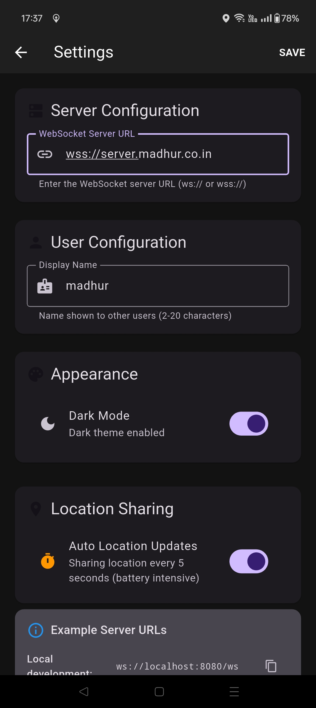
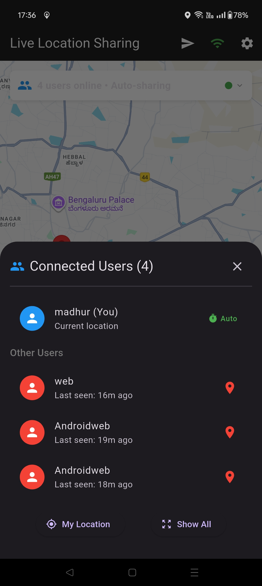
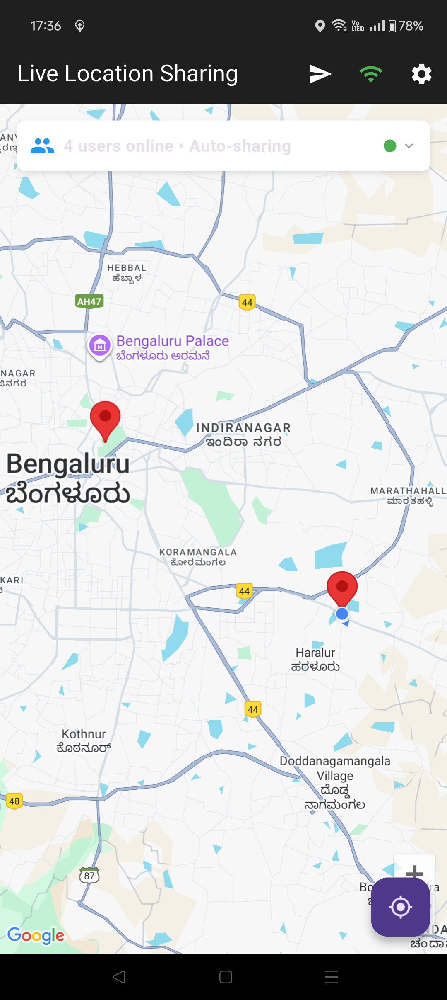

# MyTracks Flutter Client

**Share your live location with friends in real-time, across Android and the Web!**

A self-hosted, privacy-focused live location sharing application built with Flutter. Share your location with friends and family in real-time while maintaining complete control over your data through your own WebSocket server.

## 🌟 Features

### Core Functionality
*   **Real-time Location Sharing:** See your friends' current location on an interactive map
*   **Cross-Platform:** Works on Android devices and web browsers
*   **Self-Hosted Backend:** Complete data privacy with your own WebSocket server
*   **Manual & Auto Sharing:** Choose between battery-friendly manual updates or automatic location sharing
*   **User Management:** See who's online, view user lists, and manage connections
*   **Dark/Light Theme:** Customizable appearance with theme switching

### Advanced Features
*   **Smart Battery Management:** Optional auto-updates with configurable intervals
*   **Connection Status:** Real-time connection monitoring with visual indicators
*   **User Presence:** Automatic user tracking and disconnect notifications
*   **Map Controls:** Focus on specific users, show all users, or center on your location
*   **Settings Management:** Persistent configuration for server URLs, usernames, and preferences
*   **Permission Handling:** Graceful location permission requests with user guidance

## 📱 Screenshots

| Android - Map View | Android - Settings | Android - User List |
| :-------------------------: | :--------------------------: | :--------------------------: |
|  |  |  |
| *Interactive map with live locations* | *Server configuration & preferences* | *Connected users management* |

## 🏗️ Architecture

The application consists of three main components:

1.  **Flutter Client App:** Cross-platform mobile and web application
2.  **WebSocket Server:** Real-time communication backend ([MyTracksLoc/mytracks-ws-server](https://github.com/MyTracksLoc/mytracks-ws-server))
3.  **Google Maps Integration:** Interactive mapping for location visualization

### Data Flow
```
User Location → Flutter App → WebSocket Server → Other Connected Users
```

## 🚀 Getting Started

### Prerequisites

*   **WebSocket Server:** Deploy the [MyTracksLoc/mytracks-ws-server](https://github.com/MyTracksLoc/mytracks-ws-server) backend
*   **Flutter Development Environment:**
    *   Flutter SDK 3.9.0 or higher
    *   Dart SDK
    *   Android Studio (for Android development)
*   **Google Maps API Key:** Required for map functionality
*   **Web Server:** For hosting the web version (optional)

### Quick Setup

1. **Clone the repository:**
   ```bash
   git clone https://github.com/MyTracksLoc/live-location-share.git
   cd live-location-share
   ```

2. **Install dependencies:**
   ```bash
   flutter pub get
   ```

3. **Configure Google Maps API:**
   - **Android:** Add your API key to `android/app/src/main/AndroidManifest.xml`
   - **Web:** Update `web/index.html` with your API key

4. **Deploy the WebSocket server:**
   ```bash
   # Follow instructions at https://github.com/MyTracksLoc/mytracks-ws-server
   ```

5. **Run the application:**
   ```bash
   # For Android
   flutter run

   # For Web
   flutter run -d web-server --web-port 8080
   ```

### Configuration

#### Server Setup
1. **WebSocket Server URL:** Configure in the app settings
   - Format: `ws://your-server:port` or `wss://your-server:port`
   - Example: `ws://localhost:8083` or `wss://api.yourdomain.com`

2. **User Configuration:**
   - Set your display name (2-20 characters)
   - Choose between manual or automatic location sharing
   - Select theme preference (dark/light)

#### Google Maps API Setup
1. **Get API Key:** Visit [Google Cloud Console](https://console.cloud.google.com/)
2. **Enable APIs:** Enable Maps JavaScript API and Maps SDK for Android
3. **Configure Restrictions:** Set up API key restrictions for security

## 📖 Usage Guide

### First Time Setup
1. **Grant Permissions:** Allow location access when prompted
2. **Configure Server:** Enter your WebSocket server URL in settings
3. **Set Display Name:** Choose how you want to appear to other users
4. **Choose Sharing Mode:** Select manual or automatic location updates

### Sharing Your Location
1. **Manual Sharing:** Tap the send button (📤) to share your current location
2. **Automatic Sharing:** Enable auto-updates in settings for continuous sharing
3. **View Others:** See connected users on the map with real-time updates

### Managing Connections
1. **User List:** Tap the users counter to see all connected users
2. **Focus on User:** Tap a user in the list to center the map on their location
3. **Show All Users:** Use "Show All" to fit all users in the map view
4. **Connection Status:** Monitor connection health with the WiFi indicator

## 🛠️ Development

### Project Structure
```
lib/
├── main.dart                    # App entry point with theme management
├── location_sharing_screen.dart # Main map and sharing interface
├── settings_screen.dart        # Configuration and preferences
└── user.dart                   # User data model

web/
├── index.html                  # Web app entry point
└── manifest.json              # PWA configuration

android/                        # Android-specific configuration
ios/                          # iOS-specific configuration
```

### Key Dependencies
- **google_maps_flutter:** Interactive maps
- **geolocator:** Location services
- **web_socket_channel:** Real-time communication
- **permission_handler:** Location permissions
- **shared_preferences:** Settings persistence
- **uuid:** Unique user identification

### Building for Production

**Android APK:**
```bash
flutter build apk --release
```

**Web App:**
```bash
flutter build web --release
```

**iOS App:**
```bash
flutter build ios --release
```

## 🔧 Configuration Options

### App Settings
- **WebSocket Server URL:** Real-time communication endpoint
- **Display Name:** User identification (2-20 characters)
- **Theme Mode:** Dark or light appearance
- **Auto Location Updates:** Battery vs. real-time trade-off
- **Location Update Interval:** 5-second intervals for auto mode

### Server Configuration
The WebSocket server supports:
- **Maximum Users:** 100 concurrent connections
- **Update Intervals:** Minimum 2-second intervals
- **User Timeout:** 30-second stale data cleanup
- **Rate Limiting:** Protection against spam

## 🔒 Privacy & Security

### Data Privacy
- **Self-Hosted:** Your data never leaves your server
- **No Third-Party Tracking:** No analytics or data collection
- **Local Storage:** Settings stored locally on device
- **Encrypted Communication:** WSS support for secure connections

### Security Features
- **Input Validation:** All user inputs are validated
- **Rate Limiting:** Server-side protection against abuse
- **User Limits:** Configurable maximum concurrent users
- **Stale Data Cleanup:** Automatic removal of inactive users

## 🚀 Deployment

### Docker Deployment
```yaml
version: '3.8'
services:
  location-sharing-backend:
    image: mytracks-ws-server
    ports:
      - "8083:8083"
    environment:
      - NODE_ENV=production

  location-sharing-frontend:
    build: .
    ports:
      - "80:80"
    depends_on:
      - location-sharing-backend
```

### Web Hosting
Deploy the built web files to any static hosting service:
- **GitHub Pages**
- **Netlify**
- **Vercel**
- **Traditional web servers**

## 🤝 Contributing

We welcome contributions! Please follow these steps:

1. **Fork the repository**
2. **Create a feature branch:** `git checkout -b feature/amazing-feature`
3. **Make your changes** and test thoroughly
4. **Commit your changes:** `git commit -m 'Add amazing feature'`
5. **Push to the branch:** `git push origin feature/amazing-feature`
6. **Open a Pull Request**

### Development Guidelines
- Follow Flutter/Dart best practices
- Add tests for new features
- Update documentation as needed
- Ensure cross-platform compatibility

## 📋 Roadmap

### Planned Features
- [ ] **Group Management:** Create and manage location sharing groups
- [ ] **Location History:** View past location data
- [ ] **Offline Support:** Cache locations when disconnected
- [ ] **Push Notifications:** Real-time alerts for location updates
- [ ] **Custom Markers:** Personalized user markers
- [ ] **Location Sharing Links:** Share locations via URL

### Known Issues
- Web version requires HTTPS for location access
- iOS version needs additional configuration for location permissions
- Battery optimization may affect background location updates

## 🆘 Troubleshooting

### Common Issues

**Location not updating:**
- Check location permissions
- Verify GPS is enabled
- Ensure server connection is active

**WebSocket connection failed:**
- Verify server URL format (ws:// or wss://)
- Check server is running and accessible
- Ensure firewall allows WebSocket connections

**Maps not loading:**
- Verify Google Maps API key is correct
- Check API key restrictions
- Ensure billing is enabled for Google Cloud project

## 📄 License

This project is licensed under the MIT License - see the [LICENSE](LICENSE) file for details.

## 🔗 Related Projects

- **[MyTracksLoc/mytracks-ws-server](https://github.com/MyTracksLoc/mytracks-ws-server)** - WebSocket backend server
- **[uWebSockets.js](https://github.com/uNetworking/uWebSockets.js)** - High-performance WebSocket library

## 📞 Support

- **Issues:** [GitHub Issues](https://github.com/MyTracksLoc/live-location-share/issues)
- **Discussions:** [GitHub Discussions](https://github.com/MyTracksLoc/live-location-share/discussions)
- **Documentation:** Check the [Wiki](https://github.com/MyTracksLoc/live-location-share/wiki) for detailed guides

---

**Made with ❤️ for privacy-focused location sharing**

